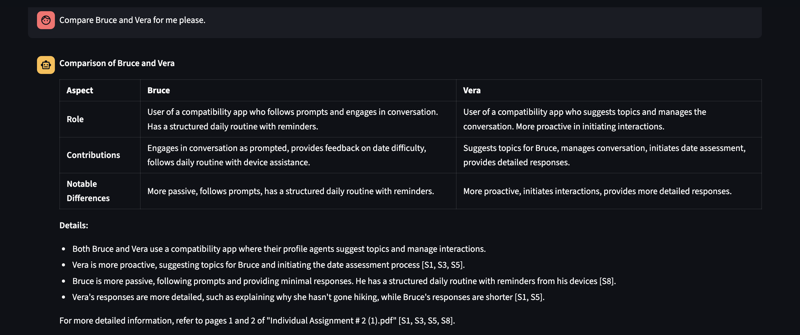

# Custom RAG (Retrieval-Augmented Generation) System

A RAG system built with FastAPI, Streamlit, and Mistral AI that enables document ingestion, intelligent retrieval, and contextual question-answering over PDF documents.

## Quick Start

### Prerequisites

- Python 3.8+
- Mistral AI API key

### Installation

1. **Clone the repository**
   ```bash
   git clone <repository-url>
   cd Custom-RAG
   ```

2. **Set up environment**
   ```bash
   make install
   ```

3. **Configure environment variables**
   Create a `.env` file in the project root and fill in the following values:
   ```bash
   MISTRAL_API_KEY=your_mistral_api_key_here
   MISTRAL_EMBED_MODEL=mistral-embed
   MISTRAL_CHAT_MODEL=magistral-small-2509
   ```
   Note: To save costs and make efficient use of limited resources, we relied on open-source models (e.g., magistral-small-2509). However, stronger alternatives are available, and different models can be tailored to specific LLM clients. For example, a MistralAI model optimized for reasoning could be used for complex reasoning tasks, while another better suited for parsing could handle structured extraction.

4. **Run the application**
   ```bash
   make run
   ```

This will start:
- **FastAPI server** on `http://localhost:8000`
- **Background worker** for document processing
- **Streamlit UI** on `http://localhost:8501`

### Alternative Run Commands

- `make api` - Run only the FastAPI server
- `make worker` - Run only the background worker
- `make dev` - Run all services with debug notes
- `make reset-db` - Reset the SQLite database

## Architecture Overview

The Custom-RAG system follows a microservices architecture with three main components:

### 1. **FastAPI Backend** (`app/`)
- **API Server**: Handles HTTP requests for document ingestion and querying
- **Ingest API** (`/ingest/pdf_documents`): Accepts PDF uploads and queues them for processing
- **Query API** (`/query`): Processes user queries and returns contextual answers

### 2. **Background Worker** (`worker.py`)
- **Asynchronous Processing**: Handles document parsing, chunking, and indexing
- **Job Queue**: Processes documents in the background using SQLite-based job queue
- **Vector Indexing**: Creates and maintains [FAISS](https://github.com/facebookresearch/faiss?tab=readme-ov-file#faiss) indices for semantic search

### 3. **Streamlit Frontend** (`ui/`)
- **Interactive UI**: Web interface for document upload and chat
- **Real-time Chat**: Conversational interface with source citations

## Core Components and Workflow


### UI


The UI is kept fairly simple here with capabilities to upload multiple PDFs at the same time. The user can start asking questions about the PDF in the chat window below after they ingest the PDF. 



Since the backend responds in a markdown format and the UI is capable of rendering it, it uses proper formatting for different kinds of responses like tables and headers.


It also lists the `top_k` sources with the ability to see the actual chunks that it referred to answer the questions, as they are cited in the response. Along with this, the ranking given to these sources are also shown in the footer of each sources.

**Note for development mode**: When the UI is run on `DEBUG` mode, a settings panel is also visible that allows you to change `localhost`, `top_k`, and `rrf_k` values. These were used to tune these parameters during development and are kept to showcase the capabilites of easy testing. 


#### Future Considerations
Apart from refining the whole UI in general, there were several features that was considered and would be implemented in the presence of more time. 

The capability to remove documents from the UI would be an easy addition so that the database can be cleared and controlled by the user. Showcasing actual document parts with the sources highlighted would also be a good addition rather than just showing chunks of sources.

### Document Ingestion


As mentioned in the above sections, document ingestion is handled by one of the endpoints of the API that is exposed by our FastAPI Backend (`/ingest/pdf_documents`). Once the user uploads the documents, the endpoint saves the data to a folder as a backup and stores the text and metadata in a SQLite Database. The service also adds this document to a SQLite based queuing system for a background service to claim this document, chunk it, embed it, and properly index it for vector similarity searches. The full-text-search (fts5) extension is also leveraged within SQLite to perform Best Matching 25 (BM25) matching function for keyword matching along with semantic matching during the retrieval process.


### Document Processing


An asynchronous background service is employed to do the necessary document processing for the retrieval process. This service queries a queue in SQLite for any `Pending` tasks and does the following:

1. **Text Extraction**: Uses [PyMuPDF](https://github.com/pymupdf/PyMuPDF) to extract text from PDFs
2. **Chunking** (`rag/chunker.py`): Splits text into 400-character chunks with 200-character overlap
3. **Embedding** (`rag/embedder.py`): Generates embeddings using Mistral's embedding model
4. **Indexing**: Creates both flat and IVFPQ FAISS indices for scalable search

Facebook AI Similarity Search ([FAISS](https://fastapi.tiangolo.com/)) is used for indexing the embeddings and these indexes are persisted in the disk. Since this project was just developed and used by one user, a flat index with inner product metrics (`IndexFlatIP`) was created first. This allows for brute-force search mechanism where the query embeddings is comparede with all the vector embeddings to find relevant vectors. The comparision is done using inner product, which is equivant to cosine similarity for normalized vectors. 

FAISS library was not necessary just for this search. However, to also ensure that this chatbot would work efficiently in case a lot of PDFs are to be queried, a IVFPQ index was also implemented. This index utilizes non-exhaustive search (Inverted File Index/IVF) and compression (Product Quantization/PQ) to find the most relevant vectors without having to exhaustively search all the vector embeddings. The IVF technique clusters the embeddings into `nlist` different clusters according to their similarity, allowing for searches only to the neighboring clusters. The PQ technique allows for smaller representation of each vectors by splitting them and quantizing each of those sub-vectors, allowing for better memory usage. 

However, this IVFPQ index requires training the clustering and quantizing algorithms to find the best way to cluster and represent the vectors, and like any statistical learning algorithms, provide benefits once enough datasets (vector embeddings) are available. Hence, the service always maintains a flat index and only trains and uses the IVFPQ index once sufficient vector embeddings are available, meaning once enough PDFs are uploaded to make this search algorithm better.


#### Future Considerations

Again, for the sake of time, a very simple fixed length naive overlapping chunking algorithm is implemented here. A fixed token size of 400 with the overlap of 200 is used with some research finding that these numbers seem to give the best results. Like any other machine learning problem, the way to find the best chunking algorithm is to iteratively test and evaluate to see which performs best for any given situation. Hence, this would be done in case we were to continue with this project.

Something that was considered and might be helpful here is also the idea of "contextual enrichment". We could add additional information in the chunks or as part of a meta data on each chunks to mention their surrounding contexts before embedding these chunks such that the similarity searches can better retrieve them.


### Query Preprocessing 


Once a user queries, the (`/query`) endpoint exposed by the FastAPI backend is triggered. The endpoint takes in the current questions as well as the historical conversations that is passed by the StreamLit interface. This triggers the LLM based refiner (`rag/query_refiner.py`) that is used to enrich the queries with contexts based on history and keep it concise before passing it to actual retrieval system. This was iteratively done in the later phases and it was found that doing this drastically improved the recall rate of the RAG system. Not only does this make the responses more conversational, but it also accounts for capturing history concisely by filtering out the unnecessary parts from it.

Once we get the refined user queries, another LLM client (`rag/intent_service.py`) is triggered, which decides the intent of the query, primarily to understand if this should instigate retrieval system or not. This is done to avoid unnecessary retrieval process in case the query is a simple conversational small talks. Since this chatbot is intended to be used just to query the PDFs, this client is tasked to only accept small talks or RAG queries. No internet queries and general Q&As are allowed.

Along with unnderstanding the intent of the query, this client also parses the query to be more semantic-search and keyword-search friendly, if a retrieval is necessary. These specific queries are passed down to their specific search algorithms for better results.

**Note:** Two different LLM clients were used here instead of one because separating them seemed to perform better. This makes sense theoritically as well since LLMs are proven to perform better at specific tasks rather than multiple tasks.

#### Future Considerations
Something that was considered and would be a good addition here is a way to understand what documents is available ahead of time and use that to understand the intent of the query. If contextual enrichment is used for chunking, we can use that to crate tags or meta data for each documents and those can be used by the `intent_service` to know ahead of time if a query is about certain documents or not.

### Retrieval System (`rag/retriever.py`)


If the query preprocessing pipeline decides that the query is supposed to trigger retrieval, a hybrid retrieval is performed combining vector similarity search and keyword search.

Using the FAISS indices (flat or IVFPQ), a cosine similarity search is performed to get `top_k * 2` most relevant vectors. Similarly, a full-text search is performed using SQLite's FTS5 extension, which essentially returns the `top_k * 2` most relevant document chunks based on the number of keyword matches. These two scores are merged using a reciprocal rank fusion (rrf) method, an aggregation technique that ensures documents that are ranked highly by the multiple retrievers are favored with diminishing returns, meaning difference between rank 1 and 2 is likely larger than rank 8 and 9. With quick research, this method seems to work better emperically than other weighted techniques.

After getting the merged ranks, a LLM based re-ranker is used to re-rank these `top_k * 2` relevant vectors and get the `top_k` relevant vectors. This is designed to re-verify the work done by the similarity searches to ensure that truly relevant vectors are retrieved. 


#### Future Considerations

For the rank merging techniques, it was considered that using weighted RRF would be beneficial as we could apply different weights based on different queries. For example, a query that asks about certain specific terms (especially if kept within quotes) might benefit from a equally or keyword-favoring search algorithm while more summary-type queries might benefit from semantic-favoring searches. This is something that would be more explored given more time.

In terms of Reranking, a LLM based reranker is used here to get a "different perspective" on the vectors as we already use similarity searches during the retrieval process. However, this does result in more latency and higher compute cost. Multi-Vector Rerankers might be a better use case here, especially if we play with different chunking techniques, as we can span the query and vectors into multiple pieces and compare the subparts, leading to a better rank validator. This is also something that would be explored more if more time is available.


### Answer Generation 
The Chat Assitnat LLM Client (`rag/chat_assitant.py`) is reponsible for generating the final response, regardless of the retrieval system being triggered. The query refined with history is used to respond, along with the sources that was retrieved in case a retrieval was performed. 

## Data Storage

### SQLite Database Schema

- **`documents`**: Metadata for uploaded PDFs
- **`jobs`**: Background processing queue
- **`chunk_meta`**: Chunk metadata and relationships
- **`chunk_fts`**: Full-text search index for chunks

### Vector Library

- **FAISS Flat Index**: Exhaustive search for small datasets
- **FAISS IVFPQ Index**: Compressed, scalable search for large datasets
- **Automatic Migration**: Switches to IVFPQ when dataset grows

## Configuration

### Environment Variables

| Variable | Description | Default |
|----------|-------------|---------|
| `MISTRAL_API_KEY` | Mistral AI API key | Required |
| `MISTRAL_EMBED_MODEL` | Embedding model | `mistral-embed` |
| `MISTRAL_CHAT_MODEL` | Chat model | `magistral-small-2509` |

### Retrieval Parameters

- **Top K**: Number of chunks to retrieve (default: 8)
- **RRF K**: Reciprocal rank fusion smoothing constant (default: 60)
- **Chunk Size**: Text chunk size in characters (default: 400)
- **Overlap**: Chunk overlap in characters (default: 200)

## Tools and Libraries Used

- **Mistral AI** for embedding and chat models
- **[FAISS](https://github.com/facebookresearch/faiss?tab=readme-ov-file#faiss)** for vector similarity search
- **[FastAPI](https://fastapi.tiangolo.com/)** for the web framework
- **[Streamlit](https://docs.streamlit.io/)** for the user interface
- **[SQLite3](https://docs.python.org/3/library/sqlite3.html)** for data storage and full-text search
- **[PyMuPDF](https://github.com/pymupdf/PyMuPDF)** for reading and parsing PDFs